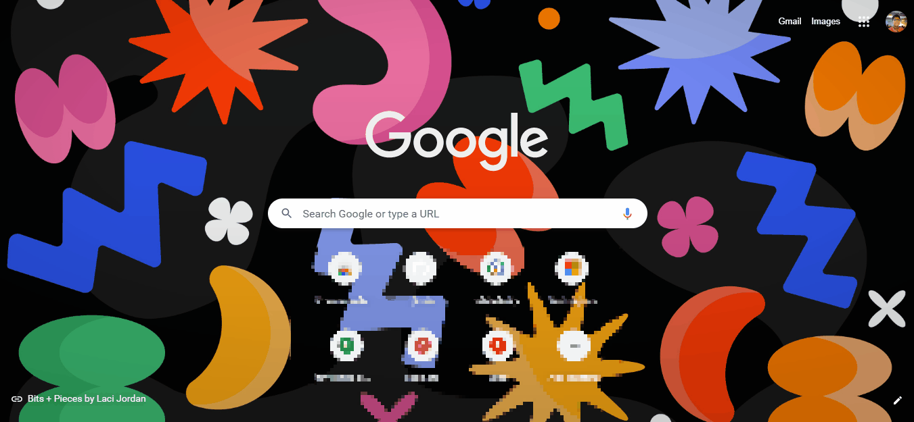

# Google Tasks Extension

Google Tasks lets you create a to-do list within your Google Chrome(as extension) or your Desktop Gmail or the Google Tasks mobile app. When you add a task, you can integrate it into your Gmail calendar, and add details or subtasks. Now , coming to you as Google Chrome Extension . 
**Made By [Junaid](https://abujuni.dev) .**

-> **Made By [Junaid](https://abujuni.dev) .**